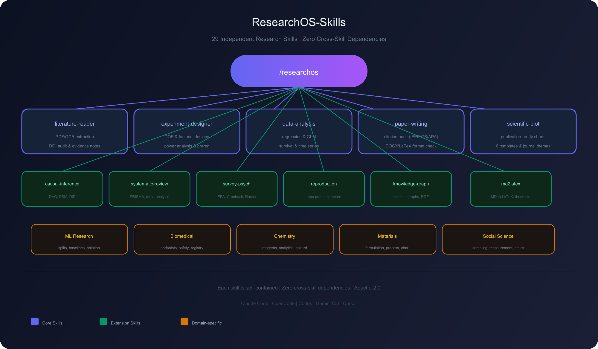
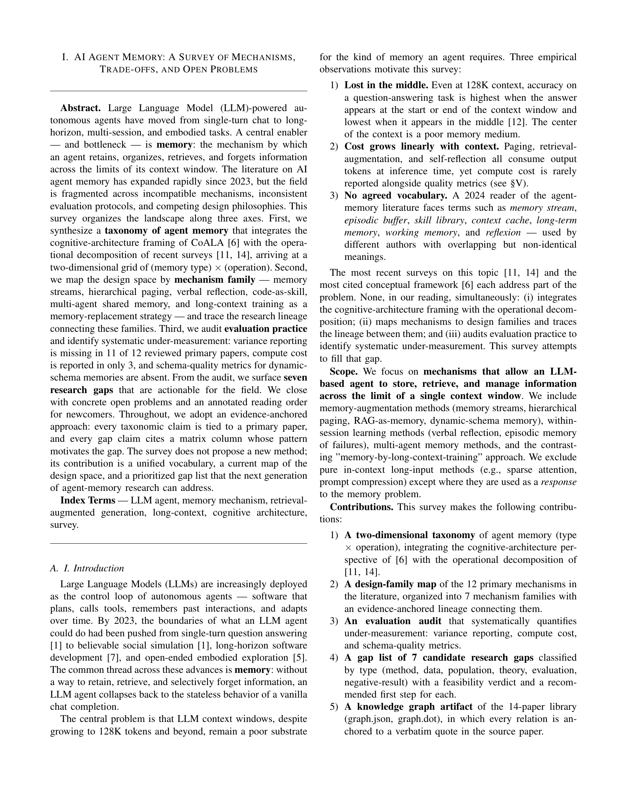

# ResearchOS-Skills

🌐 **English** · [中文](README.zh.md)

---

<div align="center">



**29 Independent Research Skills for AI Coding Agents**

*Covers the full research lifecycle: literature → design → analysis → writing → reproduction → defense*

[](LICENSE)
[](skills/)
[](skills/md2latex/tests/)

</div>

---

## 📄 Output Showcase

<div align="center">

### AI Agent Memory: A Survey of Mechanisms, Trade-offs, and Open Problems

**8-page IEEE-format survey** — taxonomy of agent memory, mechanism families, evaluation audit, 7 research gaps

[](workspace/ai-agent-memory-survey/paper/paper.pdf)


*Generated via `literature-reader` + `scientific-plot` + `md2latex`*

</div>

---

## Installation

### Quick install (all AI agent hosts)

```bash
npx skills add Hermetic-AI/ResearchOS-Skills
```

Works with: **Claude Code** · **OpenCode** · **Codex** · **Gemini CLI** · **Cursor**

### Single-skill install

```bash
npx skills add Hermetic-AI/ResearchOS-Skills --skill "literature-reader"
```

### After installation

Restart your agent. Skills appear as slash commands:

| Command | Description |
|---------|-------------|
| `/researchos` | Master orchestrator — routes to the right sub-skill |
| `/literature-reader` | Read/extract/audit papers, PDF/OCR, DOI check |
| `/data-analysis-assistant` | Analyze data, regression, survival, time series |
| `/paper-writing-assistant` | Write/check papers, citations, DOCX/LaTeX format |
| `/reproduction-assistant` | Reproduce paper code, compare results |
| `/scientific-plot` | Publication figures, statistical charts |
| `/md2latex` | Markdown→LaTeX with theorems, cross-refs, compile-check |
| `/experiment-designer` | Experiment design, DOE, power, preregistration |
| `/knowledge-graph-builder` | Build concept graphs from notes |
| ... | (29 total) |

---

## Core Skills

| Skill | Domain | Description |
|-------|--------|-------------|
| `literature-reader` | Literature | PDF/OCR extraction, DOI/arXiv/PMID audit, Zotero/BibTeX/RIS/EndNote interchange, evidence-anchored notes |
| `knowledge-graph-builder` | Knowledge | Typed concept graphs from Markdown + paper-note JSON, claim-level evidence, lineage tracing, GraphML/GEXF/RDF export |
| `experiment-designer` | Design | Randomized/factorial/DOE designs, power analysis, preregistration/SAP, randomization, adaptive monitoring |
| `data-analysis-assistant` | Analysis | Data profiling/cleaning, regression/GLM/ANCOVA, Cox/survival, SARIMAX, panel effects, MICE/sensitivity/equivalence |
| `paper-writing-assistant` | Writing | Figure/table analysis paragraphs, citation audit (GB/T 7714/IEEE/APA/ACM), DOCX/LaTeX format check, DOCX field semantics |
| `reproduction-assistant` | Reproduction | Repo probing, dependency parsing, distribution-level result comparison, failure diagnosis, isolation execution |
| `scientific-plot` | Visualization | Publication charts (6 templates, journal themes, significance stars), Excalidraw/SVG, Mermaid/Graphviz/PlantUML |
| `md2latex` | Conversion | Markdown→LaTeX: footnotes, theorems, definition lists, cross-references, image attributes, CSL→BibTeX, longtable, compile-check |

---

## Extension Skills

### Analysis & Evidence

| Skill | Description |
|-------|-------------|
| `scholarly-search-manager` | Search planning, DOI/title deduplication, RIS/BibTeX/CSV export |
| `systematic-review-meta-analysis` | PICOS/PRISMA, effect-size computation, fixed/random-effects meta-analysis, I²/τ² heterogeneity |
| `causal-inference-assistant` | DAG audits, propensity-score matching/weighting, DiD, regression discontinuity, E-value sensitivity |
| `survey-and-psychometrics` | EFA (principal-factor + varimax), Cronbach's α, item-total correlations, Rasch 1PL fitting |
| `qualitative-research-assistant` | Codebooks, Krippendorff's α, saturation-curve tracking, audit trails |

### Integrity & Management

| Skill | Description |
|-------|-------------|
| `research-project-orchestrator` | Project initialization, artifact routing, decision-provenance tracing |
| `research-integrity-and-ethics` | Ethics readiness, disclosure planning, policy-coverage audit |
| `research-data-management` | DMP, FAIR, anonymization screening, release readiness |
| `research-proposal-and-grant` | Proposal charter, Specific Aims audit, budget-assumption audit |
| `research-software-quality` | Release audit (LICENSE/README/CITATION.cff), benchmark execution |

### Communication & Defense

| Skill | Description |
|-------|-------------|
| `academic-presentation-poster` | Beamer/reveal.js slide layout, WCAG contrast checking, render-preview checklist |
| `thesis-defense-assistant` | Mock Q&A generation, timing audit, contribution-evidence coverage |
| `peer-review-and-rebuttal` | Venue-specific review templates, CONSORT/STROBE/PRISMA compliance scoring |
| `protocol-authoring` | Reporting-guideline mapping, compliance checklist, registry-summary generation |
| `patent-prior-art-search` | Patent-family parsing, timeline computation, prior-art ranking, Mermaid tree output |

### Domain-specific

| Skill | Description |
|-------|-------------|
| `machine-learning-research` | ML experiment plans: splits, leakage controls, baselines, metrics, ablations |
| `biomedical-research` | Study plans: population, endpoints, specimens, safety, registration, governance |
| `materials-research` | Experiment plans: formulation, process, characterization, calibration, provenance |
| `chemistry-research` | Experiment plans: reagents, conditions, analytical evidence, hazard/waste decisions |
| `social-science-research` | Study plans: theory, sampling, measurement, ethics, reflexivity, reporting |

---

## Project structure

```
├── skills/               ← 29 self-contained skills (each runs independently)
│   ├── literature-reader/
│   │   ├── SKILL.md            # routing + workflow
│   │   ├── agents/openai.yaml  # client discoverability
│   │   ├── scripts/            # zero-dependency Python CLIs (stdlib)
│   │   └── references/         # on-demand domain knowledge
│   └── ... (28 more)
├── tests/                ← project-level test suite (pytest)
├── schemas/              ← versioned cross-skill JSON contracts
├── tools/                ← skill validator, artifact validator, installer
├── assets/               ← architecture diagrams, paper screenshots
└── docs/                 ← development roadmap (88/88 complete)
```

**No cross-skill dependencies.** Copy any single skill directory and it works standalone.

---

## Conventions

- **Each skill is independent.** No cross-skill imports; copy one out and it runs.
- **Zero dependencies (stdlib) preferred.** Third-party needs declared with a one-line `pip install`.
- **CLI contract:** `--help`, `--version` (matches `pyproject.toml`), stderr for diagnostics, `--force` to overwrite output, never overwrites source data.
- **Reports to user:** Chinese by default; artifacts follow the artifact's language.

---

## Development

```bash
python -m pip install -e ".[dev]"
python tools/validate_skills.py
python -m pytest
```

Optional scientific stacks:

```bash
python -m pip install -e ".[analysis]"   # NumPy + SciPy
python -m pip install -e ".[plot]"       # Matplotlib + NumPy + SciPy
python -m pip install -e ".[pdf]"        # pdfplumber
python -m pip install -e ".[validation]" # SciPy + Statsmodels
python -m pip install -e ".[models]"     # pandas + Statsmodels
```

Scanned-PDF OCR additionally uses locally installed `pdftoppm` (Poppler) and `tesseract`; neither is bundled.

Cross-skill JSON contracts: `schemas/researchos-artifacts.schema.json`. Validate with:

```bash
python tools/validate_artifact.py result.json --type stat-results
```

---

## Roadmap

The implementation backlog and completion criteria are in [`docs/DEVELOPMENT_ROADMAP.md`](docs/DEVELOPMENT_ROADMAP.md). All 88 items are complete.

---

## License & Governance

- License: [Apache-2.0](LICENSE)
- Contributions: [CONTRIBUTING.md](CONTRIBUTING.md)
- Security: [SECURITY.md](SECURITY.md)
- Community standards: [CODE_OF_CONDUCT.md](CODE_OF_CONDUCT.md)
- Third-party attribution: [THIRD_PARTY_NOTICES.md](THIRD_PARTY_NOTICES.md)

Do not commit credentials, private research data, participant information, model checkpoints, scraped articles, or generated workspace artifacts.
