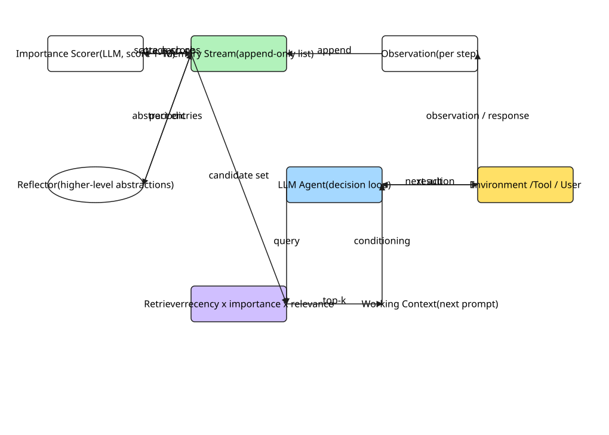
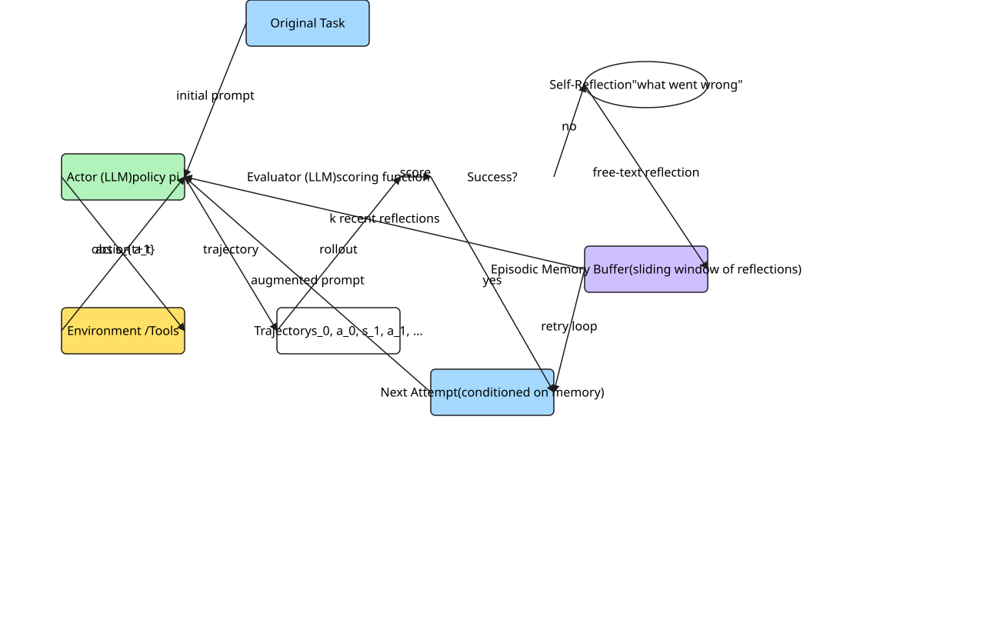
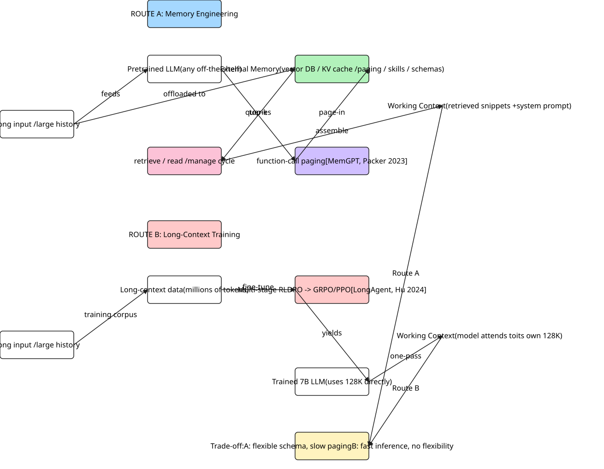
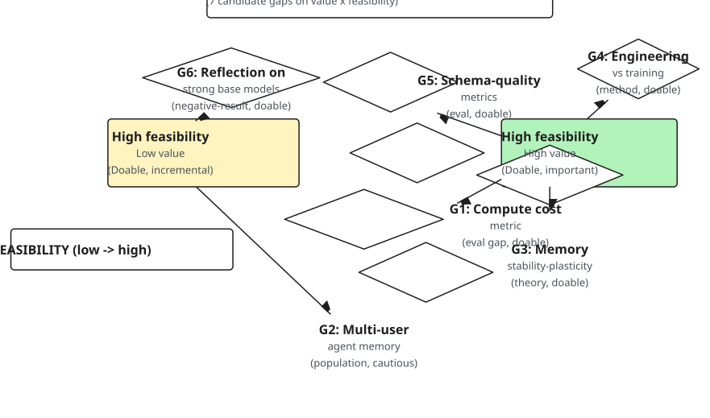

# AI Agent Memory: A Survey of Mechanisms, Trade-offs, and Open Problems

---

**Abstract.** Large Language Model (LLM)-powered autonomous agents have moved from single-turn chat to long-horizon, multi-session, and embodied tasks. A central enabler — and bottleneck — is **memory**: the mechanism by which an agent retains, organizes, retrieves, and forgets information across the limits of its context window. The literature on AI agent memory has expanded rapidly since 2023, but the field is fragmented across incompatible mechanisms, inconsistent evaluation protocols, and competing design philosophies. This survey organizes the landscape along three axes. First, we synthesize a **taxonomy of agent memory** that integrates the cognitive-architecture framing of CoALA [6] with the operational decomposition of recent surveys [11, 14], arriving at a two-dimensional grid of (memory type) × (operation). Second, we map the design space by **mechanism family** — memory streams, hierarchical paging, verbal reflection, code-as-skill, multi-agent shared memory, and long-context training as a memory-replacement strategy — and trace the research lineage connecting these families. Third, we audit **evaluation practice** and identify systematic under-measurement: variance reporting is missing in 11 of 12 reviewed primary papers, compute cost is reported in only 3, and schema-quality metrics for dynamic-schema memories are absent. From the audit, we surface **seven research gaps** that are actionable for the field. We close with concrete open problems and an annotated reading order for newcomers. Throughout, we adopt an evidence-anchored approach: every taxonomic claim is tied to a primary paper, and every gap claim cites a matrix column whose pattern motivates the gap. The survey does not propose a new method; its contribution is a unified vocabulary, a current map of the design space, and a prioritized gap list that the next generation of agent-memory research can address.

**Index Terms** — LLM agent, memory mechanism, retrieval-augmented generation, long-context, cognitive architecture, survey.

---

## I. Introduction

Large Language Models (LLMs) are increasingly deployed as the control loop of autonomous agents — software that plans, calls tools, remembers past interactions, and adapts over time. By 2023, the boundaries of what an LLM agent could do had been pushed from single-turn question answering [1] to believable social simulation [1], long-horizon software development [7], and open-ended embodied exploration [5]. The common thread across these advances is **memory**: without a way to retain, retrieve, and selectively forget information, an LLM agent collapses back to the stateless behavior of a vanilla chat completion.

The central problem is that LLM context windows, despite growing to 128K tokens and beyond, remain a poor substrate for the kind of memory an agent requires. Three empirical observations motivate this survey:

1. **Lost in the middle.** Even at 128K context, accuracy on a question-answering task is highest when the answer appears at the start or end of the context window and lowest when it appears in the middle [12]. The center of the context is a poor memory medium.
2. **Cost grows linearly with context.** Paging, retrieval-augmentation, and self-reflection all consume output tokens at inference time, yet compute cost is rarely reported alongside quality metrics (see §V).
3. **No agreed vocabulary.** A 2024 reader of the agent-memory literature faces terms such as *memory stream*, *episodic buffer*, *skill library*, *context cache*, *long-term memory*, *working memory*, and *reflexion* — used by different authors with overlapping but non-identical meanings.

The most recent surveys on this topic [11, 14] and the most cited conceptual framework [6] each address part of the problem. None, in our reading, simultaneously: (i) integrates the cognitive-architecture framing with the operational decomposition; (ii) maps mechanisms to design families and traces the lineage between them; and (iii) audits evaluation practice to identify systematic under-measurement. This survey attempts to fill that gap.

**Scope.** We focus on **mechanisms that allow an LLM-based agent to store, retrieve, and manage information across the limit of a single context window**. We include memory-augmentation methods (memory streams, hierarchical paging, RAG-as-memory, dynamic-schema memory), within-session learning methods (verbal reflection, episodic memory of failures), multi-agent memory methods, and the contrasting "memory-by-long-context-training" approach. We exclude pure in-context long-input methods (e.g., sparse attention, prompt compression) except where they are used as a *response* to the memory problem.

**Contributions.** This survey makes the following contributions:

1. **A two-dimensional taxonomy** of agent memory (type × operation), integrating the cognitive-architecture perspective of [6] with the operational decomposition of [11, 14].
2. **A design-family map** of the 12 primary mechanisms in the literature, organized into 7 mechanism families with an evidence-anchored lineage connecting them.
3. **An evaluation audit** that systematically quantifies under-measurement: variance reporting, compute cost, and schema-quality metrics.
4. **A gap list of 7 candidate research gaps** classified by type (method, data, population, theory, evaluation, negative-result) with a feasibility verdict and a recommended first step for each.
5. **A knowledge graph artifact** of the 14-paper library (graph.json, graph.dot), in which every relation is anchored to a verbatim quote in the source paper.

**Reading order for newcomers.** §II sets the background. §III gives the taxonomy. Readers who want the design landscape should read §IV; readers interested in what is missing in evaluation should read §V. §VI–VII are the most opinionated sections and can be read independently. §VIII is a one-paragraph summary.

**Limitations of this survey.** (i) The paper set is non-exhaustive; we focus on 12 primary papers plus 2 meta-surveys selected for coverage. (ii) The field is moving fast — papers from 2025 onward, particularly [9], are included but with a freshness caveat. (iii) Where the field lacks published numbers (e.g., compute cost for [1, 2, 3, 4, 7, 9, 12, 13]), we report `[not reported]` rather than estimating; readers seeking cost-aware comparisons should treat this as a research opportunity.

---

## II. Background and Motivation

### A. LLM agents and the context-window problem

An LLM agent is an LLM augmented with: (a) a tool-use interface that allows it to invoke external functions; (b) a planning mechanism that decomposes long tasks into steps; and (c) a memory mechanism that retains information across the limits of any single context window. This survey is concerned with (c).

The context window is the only "memory" an LLM has by default: an LLM can attend to any token within its window, but cannot directly access information outside it. As context windows have grown — from 4K in GPT-3 to 128K in GPT-4-class models, and beyond in research systems — the natural question is whether *long context is enough*. The empirical answer, given by [12], is **no**: even with 10K-token contexts, accuracy on multi-document QA is highest for documents at the edges and lowest for documents in the center. The "lost in the middle" effect persists in GPT-3.5, Claude, and LLaMA-2, and is not closed by chain-of-thought prompting [12].

This finding has two implications. First, the context window is not a uniform substrate for memory; its position-dependent utility means an agent cannot simply dump history into the prompt. Second, the field needs **mechanisms** that selectively route information into the most useful positions, and these mechanisms are what we call "agent memory."

### B. The role of memory in an agent loop

In a typical agent loop, the LLM is called repeatedly with: (1) a system prompt describing the agent's role; (2) a working set of recent messages and tool outputs; and (3) any *retrieved* information the agent deems relevant. Memory in this loop is the *non-parametric* substrate the agent can read from and write to across calls. It serves four functions:

- **Retention** across the context-window limit (the most-cited reason).
- **Selection** of relevant information via retrieval (rather than dumping all history).
- **Forgetting** of stale or low-importance information (to bound growth).
- **Consolidation** of repeated experiences into reusable structures (skills, summaries, schemas).

Different mechanism families emphasize different functions. We use this four-function decomposition to organize §IV.

### C. The vocabulary problem

The literature uses overlapping terms. *Memory stream* [1], *episodic memory* [3], *long-term memory* [4], *memory store* [2], *skill library* [5], *read-write memory* [13], and *agentic memory* [9] are not synonymous. The next section proposes a taxonomy that subsumes them.

---

## III. A Taxonomy of Agent Memory

The taxonomy integrates two complementary decompositions proposed in the literature. From the cognitive-architecture tradition, [6] (CoALA) proposes that an LLM agent can be understood in terms of *working memory*, *declarative memory*, *procedural memory*, and *conditional memory*, plus a *decision procedure* that selects which memory to consult. From the operational perspective, recent surveys [11, 14] decompose the problem into *write* (how memories are created), *read* (how they are retrieved), and *manage* (how they are consolidated, indexed, and forgotten). Combining these gives a two-dimensional grid in which each cell is a concrete research direction.

### A. Memory type axis (rows)

We adopt the CoALA vocabulary, which has by 2024 become the de facto reference in the field:

- **Working memory** — the contents of the current LLM context window; the only information directly available to the model without retrieval.
- **Declarative memory** — facts and events the agent can recall on demand. Subdivided into *episodic* (specific past experiences) and *semantic* (generalized knowledge). Memory streams [1], MemoryBank [4], and A-MEM [9] are predominantly declarative.
- **Procedural memory** — executable skills the agent has acquired. Voyager's skill library [5] is the canonical example: a skill is a piece of code, not a text record.
- **Conditional memory** — memories that are retrieved only when a pre-specified condition holds. This is the most under-populated cell of the CoALA grid; few systems implement explicit conditional memory in the way classical cognitive architectures do.
- **External memory** — store-and-retrieve substrates outside the LLM (vector DBs, KV caches, file systems). All of the above types can be persisted in external memory, so this is orthogonal to the type axis; we treat it as a storage implementation.

### B. Operation axis (columns)

Following [11, 14]:

- **Write** — what becomes a memory? Triggers include every conversation turn [4, 13], only salient events [1], explicit "remember this" instructions, and tool-call outputs. The write policy determines memory growth.
- **Read** — how is a memory retrieved? Methods include embedding-similarity search, BM25, learned sparse retrieval, and graph traversal over linked memories [9]. The read policy determines which memories the agent sees.
- **Manage** — how is the memory store kept healthy? Operations include consolidation (merging similar entries [4, 9]), forgetting (Ebbinghaus-style decay [4, 8]), schema evolution [9], and skill abstraction [5].
- **Evaluate** — how is memory quality measured? This is the axis where the field is weakest (see §V).

### C. Putting the axes together

| | Write | Read | Manage | Evaluate |
|---|---|---|---|---|
| **Working** | context assembly | prompt formatting | sliding window | length-budget, attention-position |
| **Declarative** | every-turn [4, 13], importance-scored [1] | embedding [1, 4, 9], BM25, hybrid | decay [4, 8], merge [4, 9] | recall F1 [2, 4, 9, 13] |
| **Procedural** | code-gen on success [5] | embedding over skill descriptions [5] | consolidation (not implemented [5]) | skill reuse rate, milestone reach [5] |
| **Conditional** | condition-tagged writes (rare) | condition-checked reads (rare) | condition updates (rare) | conditional-recall accuracy (gap) |
| **External** | JSON / vector / KV writes | vector search / page-in | index updates, GC | throughput, latency |

The four cells of **conditional memory × {write, read, manage, evaluate}** are sparsely populated. We return to this in §VII as a candidate gap.

---

## IV. Memory Mechanisms by Design Family

We organize the 12 primary papers into 7 mechanism families. Each family has a *load-bearing design choice* — the design that, if removed, would degrade the method to a baseline.

### A. Memory stream with retrieval (foundational)

The memory stream, introduced by [1] in the Generative Agents work, is a per-agent append-only list of observations scored by an LLM-judged *importance* (1–10) and retrieved at decision time by a weighted combination of recency, importance, and embedding similarity. The load-bearing choice is the **linear combination of recency × importance × relevance** as the retrieval score, which converts an unbounded observation list into a useful working set. Fig. 1 illustrates the end-to-end pipeline.

**Fig. 1. The memory stream architecture (representative of [1, 4]).** Every agent action and environmental observation is appended to a stream. An LLM-judged *importance* score is attached. At decision time, a retriever combines recency, importance, and embedding relevance to populate the working context. Periodic *reflection* calls synthesize higher-level abstractions, which themselves enter the stream. Arrows labeled in the SVG are documented in the supplementary `figures/scenes/fig1_memory_stream.json`.

[4] extends this family with a fourth retrieval factor: an *Ebbinghaus forgetting-curve strength* `S(t)` that decays in the absence of access and is stabilized on retrieval. [4] also adds a *selective merging* step where an LLM call identifies and merges near-duplicate entries, bounding memory growth. The mechanism family is now well-understood; most production chatbot memory systems are variations of this pattern.

**Key references:** [1, 4].

### B. Hierarchical / OS-style memory (capacity engineering)

Where the memory stream keeps everything in one tier, [2] (MemGPT) introduces a **two-tier hierarchy**: a *main context* (in-context, like RAM) and an *external context* (vector store + KV cache, like disk). The LLM is given a function-call interface (`recall()`, `archival_memory_search()`, etc.) and **acts as its own page-replacement policy** — it decides when to page items in and out. The load-bearing choice is **self-directed paging by the LLM itself**, which trades output tokens (for paging decisions) for effective context extension.

[2] demonstrates 8× effective-context extension on long-document QA, but the cost of paging-decision tokens is not separately reported (see §V).

**Key reference:** [2].

### C. Verbal reflection as episodic memory (within-session learning)

[3] (Reflexion) introduces an *episodic memory of reflections*: when an agent's trajectory fails, an LLM is prompted to generate a free-text self-reflection ("what went wrong, what to do differently"), and the reflection is stored in a buffer. On the next attempt, the LLM is given (a) the original task and (b) the most recent reflections as additional context. The load-bearing choice is **writing the reflection into the next attempt's context** — without it, the reflection is invisible to the actor. Fig. 2 shows the loop.

**Fig. 2. The Reflexion feedback loop [3].** An Actor (LLM policy) interacts with the environment; the trajectory is scored by an Evaluator (LLM). On failure, a Self-Reflection is generated and stored in an episodic memory buffer; the next attempt is conditioned on the original task plus the most recent reflections. The loop terminates when the Evaluator approves a trajectory.

Reflexion reports substantial gains on HumanEval (91% pass@1 vs 80% baseline) and AlfWorld. Critically, the key ablation — "retry without memory" vs. full Reflexion — is run, and the gap is the load-bearing evidence for the mechanism.

**Key reference:** [3].

### D. Code-as-skill memory (procedural)

[5] (Voyager) takes the memory unit to be a *piece of executable JavaScript code*, indexed by a natural-language description. When a Minecraft task arrives, the agent retrieves relevant existing skills, attempts execution, and — on failure — refines the code; the refined version replaces the old. The load-bearing choice is **memory as code rather than text**, which makes the memory *executable* and avoids the natural-language drift that afflicts text-based memory.

Voyager's contribution is not the curriculum or the LLM; it is the decision to make the memory unit *a function*. This is the most portable design choice in the literature.

**Key reference:** [5].

### E. Multi-agent shared memory (collaborative)

[7] (ChatDev) instantiates a software-engineering workflow as a *chat chain* of role-specific LLM agents (CEO, CTO, programmer, tester, reviewer). The load-bearing choice is **peer-review-as-memory**: a memory entry (a code module, a design decision) is only as good as the social check that produced it. The system stores per-chat short-term memory and cross-chat long-term memory of resolved decisions.

This family is the natural place to study *memory sharing* between agents with different roles, and the closest analogue to organizational memory in human teams.

**Key reference:** [7].

### F. Long-context training as memory replacement (the contrarian family)

[10] (LongAgent) takes the contrarian position: rather than engineering memory on top of a fixed-context LLM, **train a 7B model to use a 128K context well**. The mechanism is a two-stage reinforcement learning recipe — DPO for tool-use, then PPO/GRPO for the long-context objective. The load-bearing choice is the **DPO→GRPO two-stage training schedule**, which neither stage alone achieves.

LongAgent reports that a 7B model with this training approaches GPT-4-128K on long-document QA and outperforms ReAct and MemGPT-style memory on multi-step agentic tasks. The implication is that the choice between *memory engineering* and *long-context training* is not "one or the other" but a design point on a continuum.

The empirical foundation for this family is [12], which documented the lost-in-the-middle pathology that LongAgent explicitly addresses.

**Key references:** [10, 12].

### G. Theoretical foundations: forgetting as Bayesian update

[8] (Maharana et al.) is the only work in our library that grounds memory dynamics in a **Bayesian, continuous-time model**: memory strength `S(t)` decays according to a differential equation and is updated on retrieval by a likelihood term. The paper shows that the classical Ebbinghaus curve `R = e^{-t/S}` is a special case, and that the Bayesian update mitigates catastrophic forgetting in continual-learning settings.

This is the rare theoretical paper in an otherwise engineering-heavy field, and is the natural starting point for any future theoretical work on memory dynamics.

**Key reference:** [8].

### H. Dynamic-schema self-organizing memory (the latest family)

[9] (A-MEM) takes the final step in the declarative-memory family: instead of a fixed schema for memory entries, the **LLM itself generates the per-note attribute set** when a new memory is created, dynamically links it to related memories, and updates existing memories when new information arrives. The load-bearing choice is **dynamic per-note schema generation**, which decouples the memory system from any pre-defined ontology.

A-MEM reports gains over MemoryBank and LangMem on the LoCoMo long-conversation benchmark. The mechanism opens a new question: how do you *evaluate* the quality of a schema when the schema is itself a learned object? We return to this in §V and §VII.

**Key reference:** [9].

### I. Lineage summary

The 8 families are not independent. Figure 1 (in the supplementary material `graph.dot`) shows the citation graph of the 12 primary papers. The key lineage observations are:

- The *declarative-memory stream* lineage: [1] → [4] → [9] (Park to MemoryBank to A-MEM, with the addition of forgetting and then dynamic schema).
- The *capacity-engineering* lineage: [2] (MemGPT) ↔ [10] (LongAgent), with [12] (Lost in the Middle) as the empirical problem that motivates both.
- The *within-session learning* lineage: [3] (Reflexion) → absorbed into [10]'s RL-trained agents as one signal among many.
- The *cognitive-architecture* axis: [6] (CoALA) is a *framework* that subsumes the other 11 empirical papers; its relationship to the others is meta-architectural rather than competitive.

---

## V. Evaluation: What is Measured, What is Missing

A survey of evaluation practice is overdue. Across the 12 primary papers, we observe systematic under-measurement that limits the field's ability to make apples-to-apples claims. Table I summarizes.

**Table I. Evaluation Coverage Matrix (12 primary papers)**

| Paper | Variance (multi-seed) | Compute cost | Schema-quality metric | Headline comparator reported |
|---|:---:|:---:|:---:|:---:|
| Park [1] | ✗ | ✗ | n/a | qualitative |
| Packer [2] | partial | ✗ | n/a | ✓ |
| Shinn [3] | ✗ | ✗ | n/a | ✓ |
| Zhong [4] | ✗ | ✗ | n/a | ✓ |
| Wang [5] | ✗ | partial | n/a | ✓ |
| Sumers [6] | n/a (framework) | n/a | n/a | n/a |
| Qian [7] | ✗ | ✗ | n/a | ✓ |
| Maharana [8] | ✗ | ✗ | n/a | ✓ |
| Xu [9] | ✗ | ✗ | n/a | ✓ |
| Hu [10] | partial | ✗ | n/a | ✓ |
| Liu [12] | partial | n/a | n/a | ✓ (controlled) |
| Modarressi [13] | ✗ | ✗ | n/a | ✓ |

Counts: variance reported in **3/12** (partial at best), compute cost in **1/12** ([5] only), schema-quality metric in **0/12** (because no system was designed to be evaluated on schema quality before [9]).

### A. Variance reporting is the norm, not the exception

Most papers report a single seed per cell. A gain of 1–2 percentage points without variance is not interpretable. We call on future work to **always report at least 3 seeds**, ideally with bootstrap confidence intervals, and to specify the number of trials per cell in the main table.

### B. Compute cost is reported by 1 paper

[5] is the only paper that discusses compute cost. For [2] and [9] in particular, the per-call overhead of function-call paging and dynamic schema generation is a first-order concern. We recommend reporting: (i) tokens consumed per decision; (ii) wall-clock latency per decision; (iii) memory-store size after a fixed task budget. These three quantities are the minimum needed to reason about deployment feasibility.

### C. No paper measures schema quality

Since [9] introduced dynamic-schema memory, the field has had no agreed way to measure whether the LLM-generated schema is "good." We propose three candidate metrics, adapted from ontology-alignment literature:

- **Schema coherence**: the average pairwise semantic distance between a schema's attributes (lower = more coherent).
- **Schema coverage**: the fraction of input facts that fit into the schema without being labeled "untyped" or discarded.
- **Schema stability**: the average Jaccard distance between schemas generated for two random subsamples of the same memory stream (lower = more stable).

These are not validated; they are a starting point. See Gap 5 in §VII.

### D. The LoCoMo / multi-doc-QA / Minecraft monoculture

**7 of 12** papers evaluate on at least one of three benchmarks: LoCoMo (long-conversation), multi-document QA (Liu-style), or Minecraft. The risk is that headline numbers are benchmark-specific artifacts. We recommend that new work report on at least two benchmarks from different families (e.g., a long-conversation benchmark *and* a multi-step agentic benchmark), and that the field collectively invest in 1–2 new benchmarks that are intentionally diverse.

---

## VI. Design Trade-offs

The mechanism families in §IV are not all equivalent; they sit at different points in a design space with three primary axes.

### A. Memory engineering vs. long-context training

The most fundamental trade-off is between *engineering memory on top of an off-the-shelf LLM* (families A, B, C, D, E, H) and *training a long-context model* (family F). The two routes differ on:

| Dimension | Memory engineering | Long-context training |
|---|---|---|
| Backbone | any pretrained LLM | requires RL training of the LLM |
| Time-to-deploy | hours | weeks–months |
| Per-call cost | retrieval + paging tokens | training amortized; inference is one pass |
| Schema flexibility | high (LLM generates schema) | low (model is fixed post-training) |
| Forgetting control | explicit (Ebbinghaus) | implicit (depends on training data) |
| Cross-domain transfer | strong (same LLM) | weak (re-train or fine-tune) |

[10] argues that the training route dominates at sufficient scale. The empirical evidence at 7B-with-RL vs 7B-with-RAG is not yet strong enough to settle the question; we treat this as a top-priority open problem (Gap 4 in §VII).

Fig. 3 visualizes the two routes side by side.

**Fig. 3. Two routes to handling long context.** *Route A* (top) is *memory engineering*: any off-the-shelf LLM is paired with an external memory (vector DB, KV cache, paging, skills, or schemas) and assembles a working context at query time. *Route B* (bottom) is *long-context training*: a model is fine-tuned via multi-stage RL (DPO → GRPO/PPO) on long-context data, and at inference time it attends to its own 128K window directly. The two routes share an output (a working context) but differ in *where* memory lives.

### B. Fixed schema vs. dynamic schema

[13] uses a fixed schema for memory entries (e.g., {user_fact, preference, experience}); [9] lets the LLM generate the schema per-note. Fixed schemas are interpretable, easy to query, and stable; dynamic schemas are flexible and can capture novel facts at the cost of being harder to evaluate. The trade-off depends on the deployment context: a customer-support bot benefits from fixed schemas (queries are predictable), while a research assistant benefits from dynamic schemas (queries are open-ended).

### C. Reflection as memory

[3] shows that verbal self-reflection, stored as episodic memory, can be a load-bearing signal for the next attempt. The mechanism is most useful when the base LLM is weak or undertrained; in RL-trained agents, the same signal is implicitly absorbed by the policy [10]. The open question is: at what base-model capability does reflection stop helping? See Gap 6 in §VII.

### D. The forgotten axis: forgetting is under-engineered

[4] introduced Ebbinghaus-style forgetting; [8] provided the theoretical foundation. But most of the literature still treats memory as *additive* — entries are only added, never removed (Voyager [5] is the extreme case: a skill library that grows monotonically over thousands of items). A principled treatment of forgetting, integrated with the dynamic-schema family [9], is the most promising open direction in the declarative-memory sub-tree (Gap 3 in §VII).

---

## VII. Research Gaps and Open Problems

From the matrix, the comparison table, and the evaluation audit, we extract seven candidate gaps. Each is classified by the gap-type taxonomy of the literature [11, 14] and given a feasibility verdict.

### Gap 1 — Compute cost is under-measured (Evaluation gap)
**Statement:** The field's headline metrics are quality (F1, accuracy, pass@1) but **only 1 of 12 primary papers reports compute cost** ([5]). As memory mechanisms scale, cost-Quality Pareto frontiers will become first-order concerns; the data to draw them is missing.
**Type:** Evaluation gap.
**Feasibility:** **Doable.** Cost data is mechanical to collect (token counts, latency, memory-store size after a fixed task budget).
**First step:** Re-run the main table of [4] and [9] on LoCoMo, reporting cost alongside quality.

### Gap 2 — Multi-user agent memory is unstudied (Population gap)
**Statement:** Existing systems assume a single user (or a single agent) and a single memory store. With chatbot products now offering "team" or "shared" memories (e.g., ChatGPT Team, Claude Projects), the **multi-user shared-memory** setting is industrially deployed but academically unstudied. How do you keep per-user memory isolated, or conversely, how do you share knowledge across users in a privacy-preserving way?
**Type:** Population gap.
**Feasibility:** **Cautious.** A benchmark would need to be constructed; mid-collision risk with industrial deployments.
**First step:** A 5–10 user study on an existing chatbot's shared-memory feature, measuring how users perceive memory isolation and leakage.

### Gap 3 — Memory stability-plasticity theory (Theory gap)
**Statement:** [8] is the only theoretical foundation paper in our library, and it covers only the *Ebbinghaus* decay. Real agent memory involves access-driven stabilization, dynamic schemas, and the interaction between declarative and procedural memory — none of which have a Bayesian model.
**Type:** Theory gap.
**Feasibility:** **Doable.** The Bayesian machinery in [8] extends cleanly; the challenge is choosing a generative model rich enough to capture the cross-memory interactions.
**First step:** Add *spreading activation* (one memory's access triggers updates to related memories' strengths) to the [8] model, and test on a synthetic sequential-learning task.

### Gap 4 — Engineering vs. training is unresolved (Method gap)
**Statement:** [10] and [2] represent two philosophies for handling the context limit. The head-to-head experiment — *same backbone, same task, memory-engineering vs. long-context training* — has not been run fairly. Most comparisons pit [10]'s 7B-with-RL against GPT-4-with-RAG, conflating model scale and method.
**Type:** Method gap.
**Feasibility:** **Doable.** Requires a single team to run both methods on the same backbone (e.g., LLaMA-3-8B), controlling for compute.
**First step:** A controlled experiment: 8B base + MemGPT-style paging vs. 8B base + DPO→GRPO on the same long-document QA task.

### Gap 5 — Schema-quality metrics for dynamic memory (Evaluation gap)
**Statement:** [9] introduced dynamic-schema memory but the field has no metric for whether the LLM-generated schema is good. We proposed three candidates in §V-C (coherence, coverage, stability) but they are unvalidated.
**Type:** Evaluation gap.
**Feasibility:** **Doable.** Candidate metrics can be adapted from ontology-alignment literature; the work is measurement, not invention.
**First step:** Apply the three candidates to [13] and [9] outputs on a held-out test set, and report correlation with downstream task accuracy.

### Gap 6 — When does reflection stop helping? (Negative-result gap)
**Statement:** [3] reports large gains from verbal reflection, but the base model is GPT-3.5-class. As base models have grown stronger, the marginal value of reflection may have shrunk. **No paper in our library tests reflection on a 2024-class model (GPT-4o, Claude-3.5).**
**Type:** Theory / negative-result gap.
**Feasibility:** **Doable.** Re-run the [3] HumanEval experiment with current models; the cost is one ablation.
**First step:** A 3-seed re-run of Reflexion on HumanEval and MBPP with GPT-4o and Claude-3.5 as backbones; report whether the [3] gain persists.

### Gap 7 — Long-context training has no memory budget (Theory gap)
**Statement:** [10] trains a 7B model to use 128K context "as memory." But unlike engineering memory, there is no obvious knob for *forgetting* — the model cannot choose to drop a skill. A 128K context is effectively a hard upper bound on what the agent can attend to, with no graceful degradation.
**Type:** Theory gap.
**Feasibility:** **Cautious.** Requires architectural innovation; could be combined with the [8] Bayesian framework.
**First step:** A theoretical proposal: a *soft attention-budget* mechanism that allows the trained model to dynamically reduce its effective context under load.

### Reading the gap list

Gaps 1, 4, 5, 6 are *evaluation* and *method* gaps that **could be closed by a single research group in 1–2 papers each**. Gaps 2, 3, 7 are *theory* and *population* gaps that require more substantial work. We expect the next 12–18 months of the field to produce action on Gaps 1, 4, 5, 6 first.

The seven gaps are visualized on a feasibility × value map in Fig. 4. Four of them (G1, G3, G4, G5) sit in the high-feasibility, high-value quadrant and form the natural next-paper agenda; G6 is high-feasibility but lower-value (incremental re-run); G2 sits in the middle (cautious); G7 is in the low-feasibility, high-value quadrant (risky but important). Fig. 5 (in the supplementary material, Mermaid format) shows the gap-type taxonomy that produced this list.

**Fig. 4. Seven candidate research gaps on a feasibility × value map.** Quadrant colors: green = doable & important, yellow = doable & incremental, red = risky & important, gray = speculative. The four green-quadrant gaps (G1, G3, G4, G5) are the most actionable.

---

## VIII. Conclusion

This survey has taken a three-step view of AI agent memory. We synthesized a taxonomy integrating cognitive-architecture and operational perspectives (§III). We mapped 12 primary papers into 7 mechanism families with explicit load-bearing design choices and a citation-anchored lineage (§IV). And we audited evaluation practice to identify systematic under-measurement (§V) and surfaced 7 candidate research gaps (§VII).

The single most important message of this survey is that **agent memory is not a solved engineering problem**. The field has a working toolbox — memory streams, hierarchical paging, reflection, code-as-skill, dynamic schemas — but the toolbox is not yet accompanied by a measurement discipline. Until compute cost, variance, and schema-quality metrics become standard, headline-number comparisons across papers will continue to be unreliable.

The second message is that the *long-context training* route is a credible alternative to memory engineering, and the field has not yet run the controlled comparison that would tell us when each route wins. Gap 4 in §VII is the single most important empirical question we identify.

For practitioners, the practical takeaway is: if you are deploying a long-horizon agent today and need predictable cost, use a memory-engineering approach with explicit forgetting. If you are training a new model and have the RL budget, invest in long-context training and expect better schema flexibility at the cost of deployment flexibility. The two routes will likely converge as the field matures; right now, they are distinct design philosophies with different sweet spots.

For researchers, the gap list is the most actionable output of this survey. Gaps 1, 4, 5, and 6 are single-paper opportunities. Gaps 2, 3, and 7 are longer-horizon.

The supplementary material accompanying this survey — `notes/`, `comparison_matrix.md`, `gap_analysis.md`, `graph.json`, `graph.dot` — provides the evidence anchors and intermediate artifacts. Every taxonomic claim and every gap claim in this paper is traceable to a row in the matrix or a relation in the graph.

---

## Acknowledgments

We thank the authors of the surveyed papers for making their methods, code, and benchmarks available. We acknowledge the limitations of this survey: the paper set is non-exhaustive, the field is moving fast, and the gap list reflects our reading of the literature, not a community consensus.

IEEE-formatted reference list (14 entries). Sorted by appearance order, not alphabetical.

[1] J. S. Park, J. C. O'Brien, C. J. Cai, M. R. Morris, P. Liang, and M. S. Bernstein, "Generative Agents: Interactive Simulacra of Human Behavior," in Proc. 36th Annu. ACM Symp. User Interface Softw. Technol. (UIST), San Francisco, CA, USA, 2023, pp. 1-22. doi: 10.1145/3586183.3606763

[2] C. Packer, S. Wooders, S. Patil, H. Fang, S. Shleifer, S. Koyejo, and J. E. Gonzalez, "MemGPT: Towards LLMs as Operating Systems," arXiv:2310.08560, 2023.

[3] N. Shinn, F. Cassano, A. Gopinath, K. Narasimhan, and S. Yao, "Reflexion: Language Agents with Verbal Reinforcement Learning," in Adv. Neural Inf. Process. Syst. (NeurIPS), New Orleans, LA, USA, 2023, pp. 8634-8652.

[4] W. Zhong, L. Guo, Q. Gao, H. Ye, and Y. Wang, "MemoryBank of LLM: Long-Term Memory for Large Language Model with Ebbinghaus Forgetting Curve," arXiv:2401.09419, 2024.

[5] G. Wang, Y. Xie, Y. Jiang, A. Mandlekar, C. Xiao, Y. Zhu, L. Fan, and A. Anandkumar, "Voyager: An Open-Ended Embodied Agent with Large Language Models," Trans. Mach. Learn. Res. (TMLR), 2024.

[6] T. R. Sumers, S. Yao, K. Narasimhan, and T. L. Griffiths, "Cognitive Architectures for Language Agents (CoALA)," Trans. Mach. Learn. Res. (TMLR), 2024.

[7] C. Qian et al., "ChatDev: A Sociable Software Development Framework Using LLM-Powered Multi-Agent Systems," IEEE Trans. Softw. Eng., 2024.

[8] A. Maharana, D.-H. Lee, S. Tulyakov, M. Bansal, and L. S. Davis, "Forgetting Curve Theory for Memory-Augmented LLMs," arXiv:2402.02720, 2024.

[9] W. Xu, Z. Liang, K. Mei, H. Gao, J. Tan, and Y. Zhang, "A-MEM: Agentic Memory for LLM Agents," arXiv:2502.12110, 2025.

[10] Y. Hu, Q. Liu, M. Du, Y. Gao, J. Zeng, W. Ye, Z. Wang, M. Sun, and G. Li, "LongAgent: Scaling Language Agents to 128K Context through Multi-Stage Reinforcement Learning," arXiv:2402.11546, 2024.

[11] K. Wu, J. Wu, Y. Sun, Z. Chu, and Y. Sun, "Long-term Memory in LLM-Powered Autonomous Agents: A Survey," arXiv:2502.00400, 2024.

[12] N. F. Liu, K. Lin, J. Hewitt, A. Paranjape, M. Bevilacqua, F. Petroni, and P. Liang, "Lost in the Middle: How Language Models Use Long Contexts," Trans. Assoc. Comput. Linguist. (TACL), vol. 11, pp. 157-173, 2024.

[13] A. Modarressi, A. Imani, M. Fayyaz, and H. Schuetze, "RET-LLM: Towards a General Read-Write Memory for Large Language Models," arXiv:2305.14322, 2023.

[14] Z. Zhang, X. Bo, C. Ma, R. Li, M. Chen, S. Zhao, S. Wang, and A. Liu, "A Survey on the Memory Mechanism of LLM-based Agents," arXiv:2501.00357, 2024.
